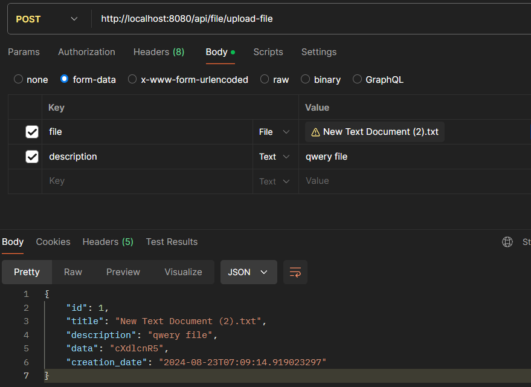

# Тестовое задание
Задача:
Необходимо реализовать микросервис, который будет выполнять роль хранилища различных файлов и их атрибутов.
Микросервис должен предоставлять HTTP API и принимать/отдавать запросы/ответы в формате JSON.
Разработка UI-интерфейса не требуется. Для тестирования можно использовать Postman или аналог.
Должны быть реализованы следующие API-методы:
# Создание файла.
На вход методу отправляется JSON, включающий в себя файл (в формате base64) и его атрибуты (название - title, дата и время отправки - creation_date, краткое описание документа - description), на выходе метод возвращает id созданного файла.
````http
  POST /api/file/upload-file-json
````
**Request Body:**
 ````JSON
  {
  "title": "Текстовый документ.txt",
  "description": "Hello qwefwqef 4",
  "creation_date": "2024-08-23T07:09:14.919023297",
  "data": "SGVsbG8gd29ybGQh"
}
 ````
**Response Body:**
 ````JSON
  {
    "id":"2"
  }
 ````
Так же была добавлена возможность отправлять файлы в качестве параметра
 ````http
  POST /api/file/upload-file
````

# Получение файла.
На вход методу отправляется id файла, на выходе метод возвращает JSON, включающий в себя файл (в формате base64) и его атрибуты (название - title, дата и время отправки - creation_date, краткое описание документа - description)
````http
  GET /api/file/find-by-id?id=1
````
**Response Body:**
 ````JSON
  {
  "id": 1,
  "title": "New Text Document (2).txt",
  "description": "qwery file",
  "data": "cXdlcnR5",
  "creation_date": "2024-08-23T07:09:14.919023"
  }
 ````

# Получение списка файлов , пагинация и сотировка по дате добавления
````http
  GET /api/file/find-all
````
**Response Body: ответ без сортировки по дате добавления** 
 ````JSON
[
  {
    "id": 2,
    "title": "Текстовый документ.txt",
    "description": "Hello qwefwqef 4",
    "data": "SGVsbG8gd29ybGQh",
    "creation_date": "2024-08-23T07:09:49.677142"
  },
  {
    "id": 1,
    "title": "New Text Document (2).txt",
    "description": "qwery file",
    "data": "cXdlcnR5",
    "creation_date": "2024-08-23T07:09:14.919023"
  }
]
 ````
**Response Body: ответ с сортировки по дате добавления**
````http
  GET /api/file/find-all?groupBy=true
````
 ````JSON
[
  {
    "id": 1,
    "title": "New Text Document (2).txt",
    "description": "qwery file",
    "data": "cXdlcnR5",
    "creation_date": "2024-08-23T07:09:14.919023"
  },
  {
    "id": 2,
    "title": "Текстовый документ.txt",
    "description": "Hello qwefwqef 4",
    "data": "SGVsbG8gd29ybGQh",
    "creation_date": "2024-08-23T07:09:49.677142"
  }
]
 ````

# Запуск приложения
````bash
    git clone https://github.com/belyavtsevrs/FileStorage.git
    cd FileStorage
````
Приложение упаковано в Docker.
* Запуск
````bash
    docker-compose up
````
* Остановка приложения
````bash
    docker-compose down
````